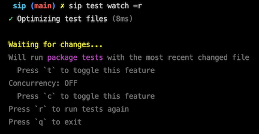

# SIP

Sip is a command-line tool with the goal of making it easier to manage the many commands needed to run a Dart or Flutter project, get dependencies, run tests, and more.


## Features

- Define and run scripts from a `scripts.yaml` file
  - Run scripts concurrently
- Run pub commands, such as `pub get` and `pub upgrade`
  - _recursively and concurrently_
- Run dart/flutter tests
  - _Recursively and concurrently_
  - Pass most all dart/flutter test flags
  - Run only dart or flutter tests

## Installation

```bash
dart pub global activate sip_cli
```

## Usage

```bash
sip --help
```

## Run Scripts

Regardless of your current working directory, the script will always be executed from the same directory as the `scripts.yaml` file.

The `sip run` command will run a script defined within the `scripts.yaml` file.

To view the flags that can be passed to `sip run`, you can run `sip run --help`.

```yaml
build_runner:
    build: dart run build_runner build --delete-conflicting-outputs
```

```bash
$ sip run build_runner build

- dart run build_runner build --delete-conflicting-outputs
...
```

For more information on the `scripts.yaml` file, see the [scripts.yaml configuration](#scriptsyaml-configuration) section.

### Environment configuration

A script can accept a file path to a file that contains environment variables. This is useful when you need to access environment variables across multiple scripts.

Since each script (in a list) is run in a separate process, the environment variables are not shared between scripts. By passing a file path to a script, the environment variables will be loaded into the script.

```yaml
# scripts.yaml

build:
    (command): flutter build apk
    (env): .env
```

If there is a script required to run to generate the environment variables, you can pass the script to the `(env)` key.

```yaml
# scripts.yaml

build:
    (command): flutter build apk
    (env):
        file: .env
        command: dart run generate_env.dart
```

This command will only run once, right before the `(command)` is run.

### Continuous Commands

Sometimes, you may want to run a command continuously, even if the command fails.

For example: The `build_runner` package will always stop running whenever the project's dependencies change. To prevent this, you can use the `--never-exit` flag.

```bash
sip run build_runner watch --never-exit
```

This should be used with caution, as this will cause the script to run indefinitely. You can stop the script by pressing `Ctrl + C`.

There is a 1 second delay between each run of the command, to prevent any runaway scripts.

## Pub Commands

### PUB GET

`sip pub get` runs `pub get` in the closest parent directory containing a `pubspec.yaml` file.

There are flags that can be passed to `sip pub get` that will be passed to `pub get`. The following flags are supported:

- offline
- dry-run
- enforce-lockfile
- precompile

_You can read more about these flags [here](https://dart.dev/tools/pub/cmd/pub-get#options)._

```bash
# Current working directory: packages/core/lib
$ sip pub get

- Running pub get

- (dart)    ./..
```

Sip can determine if flutter is being used within the project, so it will run `flutter pub get` instead of `dart pub get`.

```bash
# Current working directory: packages/ui/lib
$ sip pub get

- Running pub get

- (flutter) ./..
```

### PUB GET (Recursive)

`sip pub get --recursive` runs `pub get` in all children directories containing a `pubspec.yaml` file, **_concurrently_**.

**_Note:_** A pubspec.yaml file does not need to be present in the current working directory.

```bash
# Current working directory: packages
$ sip pub get --recursive

- Running pub get

- (dart)    ./core
- (dart)    ./data
- (flutter) ./ui
- (flutter) ./.
```

### PUB UPGRADE

`sip pub upgrade` runs `pub upgrade`. It performs and functions the same as `sip pub get` but will upgrade all dependencies to the latest version.

There are flags that can be passed to `sip pub upgrade` that will be passed to `pub upgrade`. The following flags are supported:

- offline
- dry-run
- precompile
- tighten
- major-versions
- unlock-transitive

_You can read more about these flags [here](https://dart.dev/tools/pub/cmd/pub-upgrade#options)._

> [!TIP]
> If you would like to upgrade only certain dependencies, you can pass the package's names as arguments.
>
> ```bash
> sip pub upgrade provider shared_preferences
> ```
>
> This will only upgrade the `provider` and `shared_preferences` packages.
>
> Running recursively, if these dependencies don't exist in the pubspec.yaml file, the pubspec.yaml file will be ignored

### PUB DOWNGRADE

`sip pub downgrade` runs `pub downgrade`. It performs and functions the same as `sip pub get` but will downgrade all dependencies to the latest version.

There are flags that can be passed to `sip pub downgrade` that will be passed to `pub downgrade`. The following flags are supported:

- offline
- dry-run
- tighten

_You can read more about these flags [here](https://dart.dev/tools/pub/cmd/pub-downgrade#options)._

### PUB DEPS

`sip pub deps` runs `pub deps` in the closest parent directory containing a `pubspec.yaml` file.

There are flags that can be passed to `sip pub deps` that will be passed to `pub deps`. The following flags are supported:

- style
- dev
- executables
- json

_You can read more about these flags [here](https://dart.dev/tools/pub/cmd/pub-deps#options)._

### PUB CONSTRAIN

`sip pub constrain` will modify the `pubspec.yaml` file to constrain the version of each dependency to the version that is currently being used.

```yaml
# pubspec.yaml (BEFORE)
name: package

dependencies:
  provider: ^5.0.0
  shared_preferences: 2.0.0
  http: ^0.13.3
  dio: ">=4.0.0 <5.0.0"
```

```bash
sip pub constrain
```

```yaml
# pubspec.yaml (AFTER)
name: package

dependencies:
  provider: ">=5.0.0 <6.0.0"
  shared_preferences: ">=2.0.0 <3.0.0"
  http: ">=0.13.3 <0.14.0"
  dio: ">=4.0.0 <5.0.0"
```

If you would like to constrain only certain dependencies, you can pass the package's names as arguments.

```bash
sip pub constrain provider shared_preferences
```

```yaml

Flags:

- **recursive**: Constrain all dependencies in all children directories containing a `pubspec.yaml` file.
- **dev_dependencies**: Constrain the dev_dependencies in the `pubspec.yaml` file.
- **bump**: Choose which version to bump to. The options are `breaking`, `major`, `minor`, and `patch`.
- **dry-run**: Print the changes that will be made without actually making the changes.
- **dart-only**: Only constrain dart dependencies.
- **flutter-only**: Only constrain flutter dependencies.

## Running Tests

Sip can run dart/flutter tests, and pass most all dart/flutter test flags. To view all the flags that can be passed to `sip test`, you can run `sip test --help`.

```bash
# Run all tests
$ sip test --recursive --concurrent
```

## Running only dart or flutter tests

By default, sip will run all tests, regardless of whether the project is a dart or flutter project. If you would like to run only dart tests, you can run:

```bash
sip test --dart-only
```

If you would like to run only flutter tests, you can run:

```bash
sip test --flutter-only
```

## Watch Mode

Sip can watch for changes in the project and run the tests whenever a file changes. To run tests in watch mode, you can run:

```bash
sip test watch
```

### Ways to run tests

Sip can run tests in a few different ways:

#### Run all tests

```bash
sip test watch --run all
```

When a file changes in the project, all tests will be run. This is helpful if you want to ensure that the changes you made did not break any tests.

#### Run package tests

```bash
sip test watch --run package
```

When a file changes in the project, only the tests in the package will be run. This is helpful if you want to ensure that the changes you made did not break any tests in the package.

#### Run file tests

```bash
sip test watch --run file
```

When a file changes in the project, only the tests in the file will be run. This is helpful if you want to ensure that the changes you made did not break any tests for that file. This is also a great way for [TDD](https://en.wikipedia.org/wiki/Test-driven_development)!

### Toggle run states

Toggling these states during watch mode is possible by pressing the `t` key in the terminal.



In addition to toggling the run states, you can also toggle the `--concurrent` flag by pressing the `c` key in the terminal.

### --bail

Bailing on tests means that the moment a test fails, the script will stop running, even if there are other tests to run.

By passing the `--bail` flag, the script will stop running after the a test fails. For dart tests, the `--bail` flag will enable the `--fail-fast` flag.

```bash
sip test --bail
```

## `Scripts.yaml` configuration

The `scripts.yaml` file is where you define all the scripts that you would like to run. The `scripts.yaml` file is generally located in the root of your project.

### Defining a script

A script is defined by a key, followed by a colon `:`. The key is the name of the script, and the value is the command to run.

```yaml
# scripts.yaml

build_runner: dart run build_runner build --delete-conflicting-outputs
```

```bash
sip run build_runner # Runs `dart run build_runner build --delete-conflicting-outputs`
```

The value of the script can be a string or a list of strings.

```yaml
# scripts.yaml

build_runner:
    - cd packages/core && dart run build_runner build --delete-conflicting-outputs
    - cd packages/data && dart run build_runner build --delete-conflicting-outputs
```

```bash
$ sip run build_runner

- cd packages/core && dart run build_runner build --delete-conflicting-outputs
...
- cd packages/data && dart run build_runner build --delete-conflicting-outputs
...
```

### Restricted Script Keys

- Allowed characters regex pattern: `^_?([a-z][a-z0-9_.\-]*)?(?<=[a-z0-9_])$`
- Keys that start and end with a parenthesis `(` `)` are reserved for sip.
- Keys must start with a letter or an underscore followed by a letter (optional)
- Keys must end with a letter, number, or underscore

### Nesting scripts

You can nest scripts within other scripts. This helps with reusability and organization.

```yaml
# scripts.yaml

format:
    ui: cd packages/ui && dart format .
    core: cd packages/core && dart format .
```

If you would like to define a script to run **_and_** nest scripts, you can use the `(command)` key to define the command to run.

```yaml
# scripts.yaml

format:
    (command): dart format .
    ui: cd packages/ui && dart format .
    core: cd packages/core && dart format .
```

```bash
sip run format # Runs `dart format .`

sip run format ui # Runs `cd packages/ui && dart format .`
```

### List Commands

You can list all the scripts that are defined within the `scripts.yaml` file.

```bash
sip list # or sip ls
```

> [!TIP]
> You can search for a script by passing in a query after the command
>
> ```bash
> sip list build_runner
> ```


You can filter nested scripts by passing in the `--list` flag.


### Referencing other scripts

You can reference other scripts within the `scripts.yaml` file by using the `{$<key>}` symbol. When referencing a script, the command defined for that referenced script will be used.

```yaml
# scripts.yaml

pub_get: dart pub get

pub_get_ui: cd packages/ui && {$pub_get}
```

```bash
$ sip run pub_get

- cd packages/ui && dart pub get
```

Chain references together to access nested scripts.

```yaml
# scripts.yaml

pub:
    (command): dart pub
    get: '{$pub} get'
    ui: cd packages/ui && {$pub:get}
```

```bash
$ sip run pub get ui

- cd packages/ui && dart pub get
```

**_NOTICE:_** The `(command)` key is omitted when referencing a script.

### Flags

By default, all flags passed after the script are ignored.

```yaml
# scripts.yaml

test: dart test
```

```bash
$ sip run test --coverage

- dart test # The --coverage flag is ignored
```

If you would like to tell sip to include a flag _**if it is provided**_ you can use the `{-<flag>}` symbol. Any and all values passed after the flag will be passed to the script.

These flags will remain optional, and can be omitted when running the script.

```yaml
# scripts.yaml

test: dart test {--coverage}

other: other {--flag} {--verbose}
```

```bash
# Supports `=` or spaces
$ sip run test --coverage=coverage

- dart test --coverage=coverage

# Supports multiple values
$ sip run other --flag value1 value2

- other --flag value1 value2

# Supports flags with no values
$ sip run other --verbose

- other --verbose

# Supports multiple flags
$ sip run other --flag value1 value2 --verbose

- other --flag value1 value2 --verbose

# Ignores non-defined flags
$ sip run other --fake

- other
```

### Private keys

Private keys cannot be invoked from the command line, but can be used as references in the `scripts.yaml` file.

To define a private key, prepend the key with the `_` symbol.

```yaml
# scripts.yaml

format:
    _hidden: dart format .
    (command): cd packages/ui && {$format:_hidden}
```

### Bail

Bailing on a script means that the moment a command fails, the script will stop running, even if there are other commands to run.

You can bail a script if you pass the `--bail` flag when running the script.

```bash
$ sip run format --bail

...
✖ Script dart run format failed with exit code unknown: 1

✖ Bailing...
```

Optionally, you can always set a script to fail by using the `(bail):` key in the `scripts.yaml` file.

```yaml
# scripts.yaml

format:
    (bail): # leave blank, or set to: `true`, `yes`, `y`
    (command): dart format
```

```bash
$ sip run format

...
✖ Script dart run format failed with exit code unknown: 1

✖ Bailing...
```

### Run Commands Concurrently

Running scripts concurrently can be useful when you have multiple commands that can be run at the same time. To run commands concurrently, you can run the `sip run` command with the `--concurrent` flag.

```yaml
# scripts.yaml

test:
    - cd packages/ui && dart test
    - cd packages/core && dart test
```

```bash
$ sip run test --concurrent

Running 2 scripts concurrently

- cd packages/ui && dart test
- cd packages/core && dart test
```

Sometimes you may want to single out a group of commands to run concurrently, You can use the concurrent key `(+)` to achieve this.

The commands will be grouped together and run concurrently. Meaning that you can have concurrent and non-concurrent commands mixed together. The commands will always run in the order they are defined.

**Note:**

- The concurrent key _must_ be followed by a space.
- The concurrent key _must_ always be the first characters in the command string.

```yaml
# scripts.yaml

format:
    (command):
        - echo "Running format"
        # ---- start concurrent group
        - (+) cd packages/ui && dart format .
        - (+) cd packages/core && dart format .
        # ---- end concurrent group
        - echo "Finished running format"
```

### Variables

A variable is a placeholder for a value that is to be provided when the script is run. Variables cannot be invoked from the command line, but can be used in the `scripts.yaml` file.

_Variables do not use the `$` symbol._

Sip provides a few variables out of the box that can be used within the `scripts.yaml` file

- `{packageRoot}`: The directory that the pubspec.yaml file is in
- `{scriptsRoot}`: The directory that the scripts.yaml file is in
- `{cwd}`: The current directory that you are in

If you need to create your own variable, you can define them under the `(variables)` key

```yaml
# scripts.yaml
(variables):
    # Check if flutter is installed and that the project is a flutter project
    dartOrFlutter: |-
      if [ -n "$(which flutter)" ] && grep -q flutter pubspec.lock; then
          COMMAND="flutter"
      else
          COMMAND="dart"
      fi

      $COMMAND

deps: cd packages/ui && {dartOrFlutter} pub get
```

```bash
$ sip run deps

- if [ -n "$(which flutter)" ] && grep -q flutter pubspec.lock; then
      COMMAND="flutter"
  else
      COMMAND="dart"
  fi

  $COMMAND pub get
```

^^^ This command will run `flutter pub get` since the `ui` project is a flutter project.

### Example `scripts.yaml` file

```yaml
# scripts.yaml

(variables):
    flutter: fvm flutter

# The name of the script
build_runner:
    # The command to run
    build: dart run build_runner build --delete-conflicting-outputs
    watch:
        # The description of the script
        (description): Run build_runner in watch mode

        # The alternative way to define the command
        (command): dart run build_runner watch --delete-conflicting-outputs

        # The aliases for the script
        (aliases):
            - w

test:
    # {--coverage} is an optional argument, if it is provided, it will be passed into the command, otherwise it will be ignored
    (command): '{flutter} test {--coverage}'

    # {$test} references the defined script `test`. The flag `--coverage=coverage` will activate the coverage flag found in`test`, passing it (--coverage) and it's value (=coverage) to the `test` command
    # Supported flag formats:
    #    e.g. --flag  |  --flag=value  |  --flag value1 value2
    # Supports multiple flags
    #    e.g. --flag1 --flag2=value2 --flag3 value3 value4
    coverage: "{$test} --coverage=coverage"

echo:
    dirs:
        - echo "{packageRoot}" # The directory that the pubspec.yaml file is in
        - echo "{scriptsRoot}" # The directory that the scripts.yaml file is in
        - echo "{cwd}" # The current directory that you are in

format:
    _command: dart format .
    (command):
        - echo "Running format"
        # ---- start concurrent commands
        - (+) {$format:ui} # References the Format UI command
        - (+) {$format:data} # References the Format Data command
        - (+) {$format:application} # References the Format Application command
        # ---- end concurrent commands
        - echo "Finished running format"

    ui: cd packages/ui && {$format:_command}
    data: cd packages/data && {$format:_command}
    application: cd application && {$format:_command}
```
